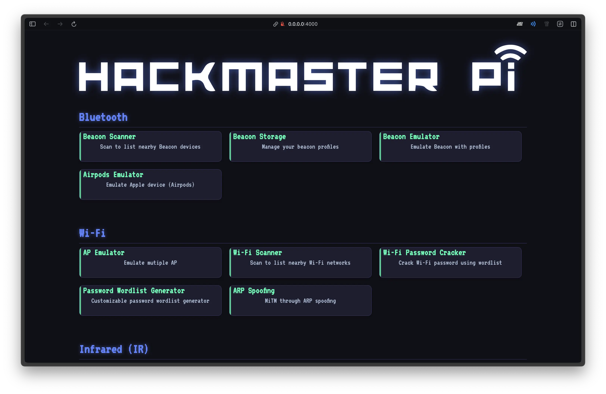

import { Card, CardGrid } from '@astrojs/starlight/components';

## Features

<CardGrid stagger>
	<Card title="Cheap" icon="star">
		Only costs about $30.
	</Card>
	<Card title="Multifunction" icon="seti:json">
		Contains Bluetooth, Wi-Fi, infrared, NFC, USB and other related functions.
	</Card>
	<Card title="User-friendly" icon="heart">
		Using the Web UI.

		
	</Card>
	<Card title="Open source" icon="rocket">
		If you have any suggestions for improvements or find any bugs, feel free to fork the [repository](https://github.com/1PingSun/HackMaster-Pi) on GitHub and submit a pull request. We appreciate your contributions!

		If you find this project useful, please give it a star on GitHub. Your support is greatly appreciated!
	</Card>
</CardGrid>
