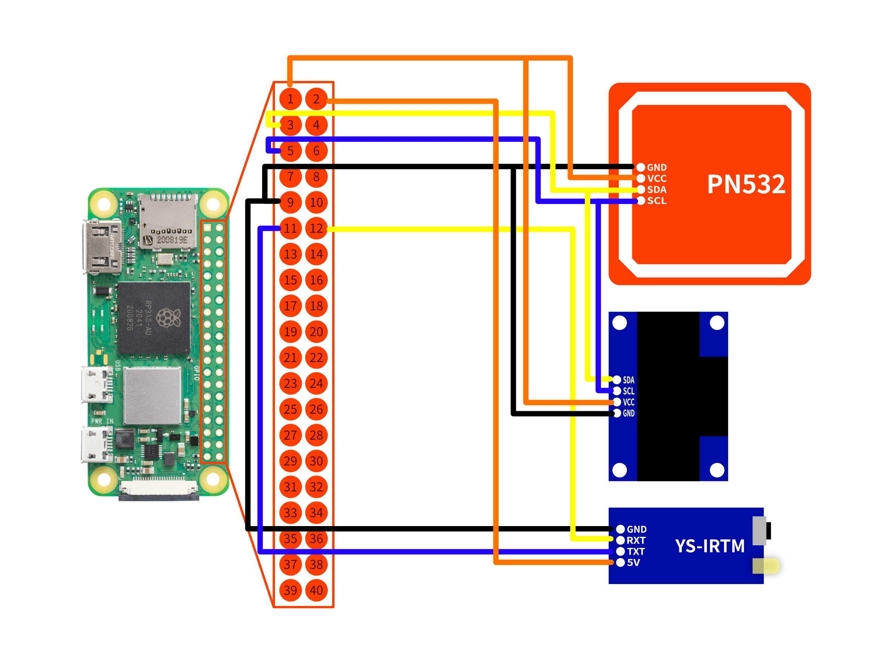

This guide will show you how to assemble your Raspberry Pi Zero 2 W for the HackMaster Pi.

## 3D Case

1. Download 3D modules: [https://github.com/1PingSun/HackMaster-Pi/tree/main/3D-Modules](https://github.com/1PingSun/HackMaster-Pi/tree/main/3D-Modules).
2. Print the 3D modules with 3D printer.
3. Assemble the components and the Raspberry Pi Zero 2 W into the 3D case modules.

## Connect the Circuit

You can follow the circuit diagram to connect the components.

* PN532 NFC Component
  * VCC → Raspberry Pi 3.3V (pin 1)
  * GND → Raspberry Pi GND (pin 6)
  * SDA → Raspberry Pi SDA (pin 3)
  * SCL → Raspberry Pi SCL (pin 5)
* OLED 0.96" Screen
  * VCC → Raspberry Pi 3.3V (pin 1)
  * GND → Raspberry Pi GND (pin 6)
  * SDA → Raspberry Pi SDA (pin 3)
  * SCL → Raspberry Pi SCL (pin 5)
* YS-IRTM IR Component
  * VCC → Raspberry Pi 5V (pin 2)
  * GND → Raspberry Pi GND (pin 6)
  * RXT → Raspberry Pi GPIO 18 (pin 12)
  * TXT → Raspberry Pi GPIO 17 (pin 11)

