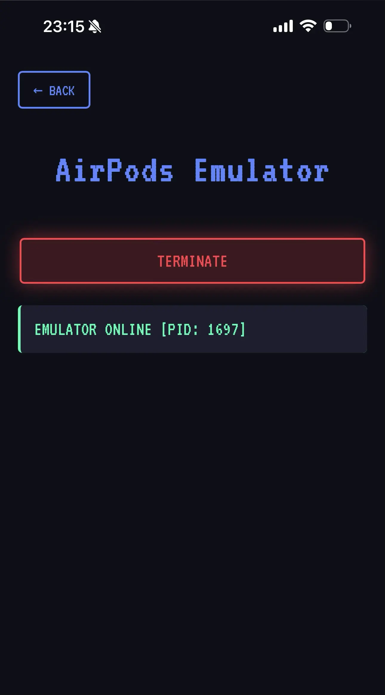

This page will show you how to emulate a fake AirPods device on HackMaster Pi.

1. Open the `AirPods Emulator` page: `http://[IP]/BLE/airpods-emulator`.
2. Press the `ACTIVATE` button to activate the AirPods Emulator.
    
    
    
3. A pop-up window will pop up on nearby Apple devices as show below.
    
    

    Source: https://support.apple.com/zh-tw/104989

4. After that, press the `TERMINATE` button to terminate the AirPods Emulator.

    

