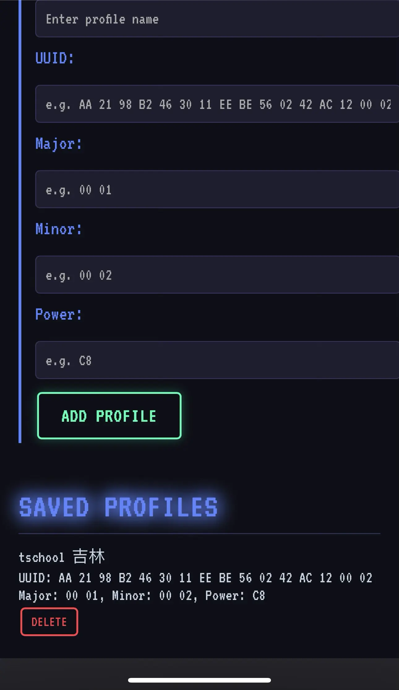

This page will show you what a Bluetooth beacon is and how to emulate a Bluetooth beacon device on HackMaster Pi.

## What is a Bluetooth Beacon?

A Bluetooth beacon is a small wireless device that broadcasts signals using Bluetooth Low Energy (BLE) technology. These devices are designed to transmit simple data over short distances.

### Key Points About Beacons:

* Small and Portable: They're typically small hardware devices that can be placed almost anywhere.
* Battery-Powered: Most beacons run on batteries and can last for months or years.
* One-Way Communication: Beacons only send signals; they don't receive information back.
* Location Services: Their main purpose is to help with indoor positioning where GPS doesn't work well.

## How to Emulate a Bluetooth Beacon Device?

Here we will show you how to emulate a Bluetooth beacon device through a clock-in system example.

1. Use the Android mobile phone close to the clock-in Bluetooth device.
2. Download and open `BLE Scanner` app: [https://play.google.com/store/apps/details?id=com.macdom.ble.blescanner&pcampaignid=web_share](https://play.google.com/store/apps/details?id=com.macdom.ble.blescanner&pcampaignid=web_share).
3. Find the Bluetooth device with the highest dBm value.

    

4. Note the `UUID`, `Major` and `Minor` values. For example, in the picture above:
    * UUID: `AA2198B2-4630-11EE-BE56-0242AC120002`
    * Major: `0`
    * Minor: `0`

5. Convert them to hexadecimal data with a space character between each byte. For example, in the picture above:
    * UUID: `AA 21 98 B2 46 30 11 EE BE 56 02 42 AC 12 00 02`
    * Major: `00 00`
    * Minor: `00 00`

6. Enter them in the `Beacon Storage` page: `http://[IP]/BLE/beacon-storage`

    

7. Press `ADD PROFILE` button to save the Bluetooth beacon information.

    

8. Go to the `Beacon Emulator` page (`http://[IP]/BLE/beacon-emulator`), select the Bluetooth beacon information profile, and then you can activate and terminate it.

    

