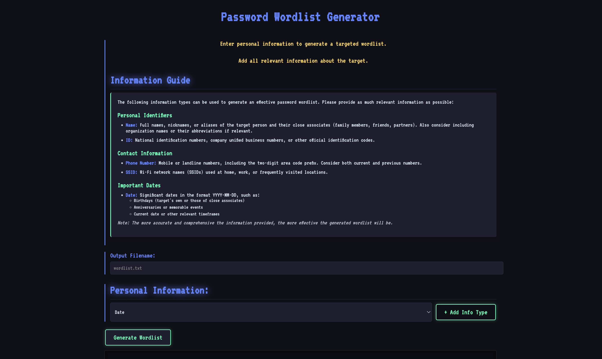

This page will show you how to create your custom wordlist on HackMaster Pi.

The following information types can be used to generate an effective password wordlist. 

* **Name:** Full names, nicknames, or aliases of the target person and their close associates (family members, friends, partners). Also consider including organization names or their abbreviations if relevant.
* **ID:** National identification numbers, company unified business numbers, or other official identification codes.
* **Phone Number:** Mobile or landline numbers, including the two-digit area code prefix. Consider both current and previous numbers.
* **SSID:** Wi-Fi network names (SSIDs) used at home, work, or frequently visited locations.
* **Date:** Significant dates in the format YYYY-MM-DD, such as:
  * Birthdays (target's own or those of close associates)
  * Anniversaries or memorable events
  * Current date or other relevant timeframes

## How to Use Password Wordlist Generator?

1. Set up wordlist file name
2. Select relevant personal information categories, then add and fill in details
3. Click "Generate Wordlist" to create the wordlist file

