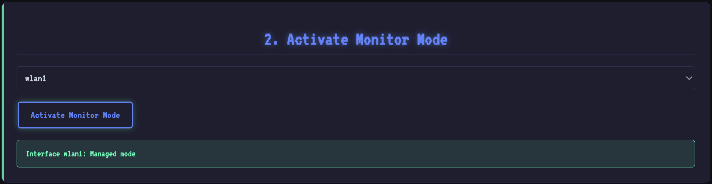
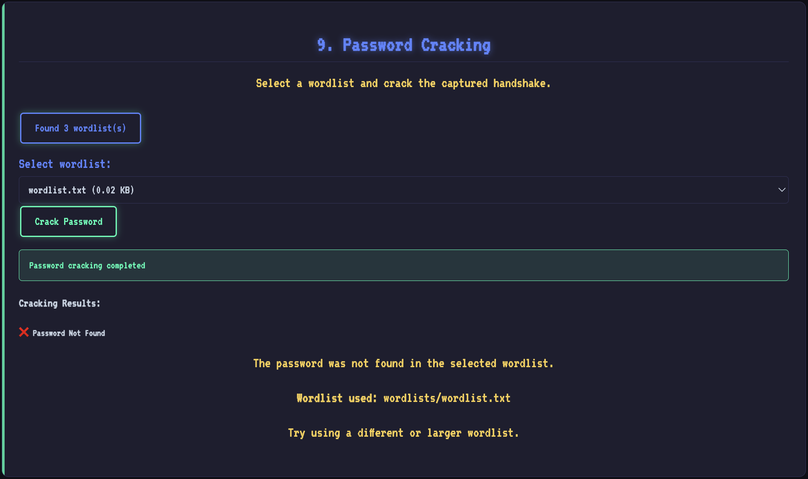

This page will show you how to crack the Wi-Fi password on HackMaster Pi.

1. List network adapters.
    
2. Select network adapter and activate monitor mode.
    
3. Press "Scan Wi-Fi Networks" and wait about 20 seconds to see the nearby Wi-Fi access points.
    
4. Select a target AP and set channel.
    
5. Start capturing traffic.
    
6. Send deauth packets.
    
7. Stop capturing traffic.
    
8. Check packet handshakes.
    
9. Load wordlists and crack password
    