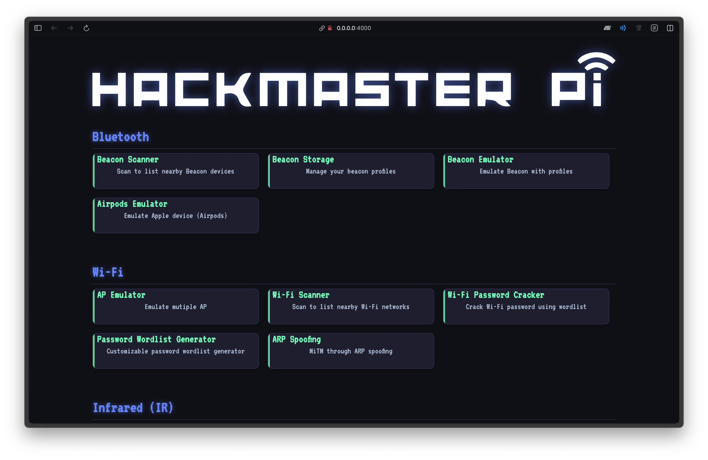

import { Card, CardGrid } from '@astrojs/starlight/components';

## 核心特色

<CardGrid stagger>
	<Card title="低成本" icon="star">
		總成本僅需 NT$ 1,100 元，相較於市售專業工具節省 82-86%，比專業顧問檢測更是節省 98% 的費用。
		
		
	</Card>
	<Card title="易於使用" icon="heart">
		透過 Web UI 操作介面，降低使用門檻，讓沒有資安背景的人也能輕鬆上手。

		
	</Card>
	<Card title="多功能整合" icon="seti:json">
		整合藍牙、Wi-Fi、紅外線、NFC、USB 等多種功能，涵蓋常見的 IoT 安全檢測情境。
	</Card>
	<Card title="開源協作" icon="rocket">
		如果您有任何改進建議或發現錯誤，歡迎在 GitHub 上 [fork 儲存庫](https://github.com/1PingSun/HackMaster-Pi)並提交 pull request。我們非常感謝您的貢獻！

		如果您覺得這個專案有用，請在 GitHub 上給我們一顆星星。您的支持是我們最大的動力！
	</Card>
</CardGrid>

## 為什麼選擇 HackMaster Pi？

### 環境永續效益

- **延長設備壽命 30-50%**：透過主動檢測及早發現安全漏洞，避免設備因惡意程式持續運作而過度耗損
- **大幅減少電子垃圾**：預防設備提前汰換，降低電子垃圾產生量 40-60%
- **避免能源浪費**：防止設備被惡意操控造成不必要的能源消耗

### 社會責任實踐

- **降低社會整體風險**：減少殭屍網路節點，保護網路服務的可用性
- **促進資安知識普及**：提供經濟實惠的教育平台，降低資安學習門檻
- **實踐企業永續營運**：協助中小企業以極低成本建立主動式安全防護

### 經濟效益分析

相較於其他解決方案的成本比較：
- **Flipper Zero**（NT$ 6,000）：節省 82%
- **Wi-Fi Pineapple**（NT$ 8,000）：節省 86%
- **專業顧問檢測**（NT$ 50,000+）：節省 98%

## 專題背景

隨著物聯網設備數量快速增加，攻擊規模也跟著成長。全球物聯網攻擊數量從 2018 年的 3,200 萬飆升至 2022 年的 1.12 億。這些攻擊不只造成經濟損失，還會縮短設備壽命、增加電子垃圾，甚至造成大規模能源浪費。

HackMaster Pi 提供一套低成本的「主動式 IoT 安全檢測系統」，讓中小企業和個人也能負擔得起專業的安全檢測。透過主動檢測取代被動應對，從「攻擊者思維」的角度找尋攻擊面並修復，保護您的 IoT 設備，同時也保護整個社會的數位環境。
