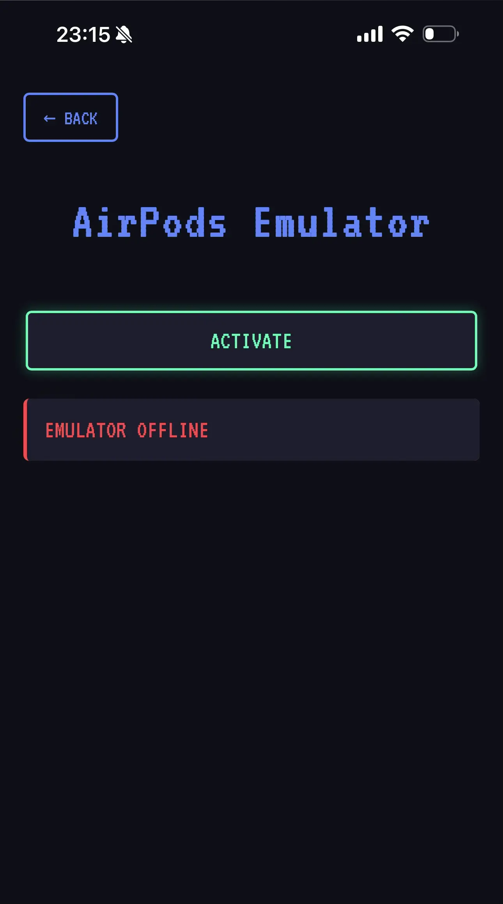
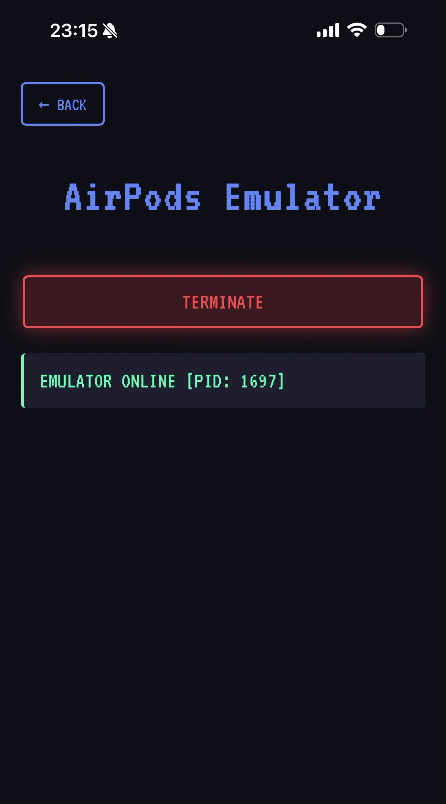

本頁面將示範如何在 HackMaster Pi 上模擬假的 AirPods 設備，用於測試使用者的安全意識。

## 功能說明

AirPods 模擬器可以模擬 Apple AirPods 的藍牙配對訊號，讓附近的 Apple 設備（iPhone、iPad、Mac）彈出配對視窗。這個功能可以用來：

- **測試使用者警覺性**：評估員工或使用者是否會隨意連接不明藍牙設備
- **安全意識訓練**：展示藍牙攻擊的風險，提升資安意識
- **環境安全評估**：檢測辦公環境中是否有人容易受到此類攻擊

:::caution[合法使用提醒]
本功能僅供安全教育和測試自有設備使用。未經授權干擾他人設備可能違反《刑法》第 359 條（干擾電腦罪）。請確保：
- 僅在取得明確授權的環境中使用
- 不要在公共場所隨意啟動
- 用於教育訓練時需事先告知參與者
:::

## 操作步驟

1. 開啟 `AirPods Emulator` 頁面：`http://[IP]/BLE/airpods-emulator`

2. 按下 `ACTIVATE` 按鈕以啟動 AirPods 模擬器。
    
    
    
3. 附近的 Apple 設備將會彈出配對視窗，如下圖所示。
    
    

    圖片來源：https://support.apple.com/zh-tw/104989

4. 測試完成後，按下 `TERMINATE` 按鈕以終止 AirPods 模擬器。

    

## 使用情境範例

### 情境一：企業資安訓練
在取得員工同意的情況下，於辦公室啟動 AirPods 模擬器，觀察有多少員工會嘗試連接不明設備。透過這個實際演練，可以：
- 評估員工的資安意識水平
- 作為後續訓練課程的引導案例
- 建立安全操作規範

### 情境二：個人設備安全測試
測試自己的 Apple 設備是否會自動連接不明藍牙設備：
- 檢查是否有舊的配對記錄
- 驗證設備的藍牙安全設定
- 了解可能的攻擊風險

### 情境三：會議室環境評估
在進行重要會議前，檢測會議室周邊是否有可疑的藍牙設備：
- 使用 HackMaster Pi 掃描環境
- 記錄正常的已知設備
- 偵測異常的未知設備

## 防護建議

### 對個人使用者
- **謹慎配對**：不要隨意連接不明的藍牙設備
- **關閉自動連接**：在設定中關閉藍牙的自動連接功能
- **定期清理**：定期檢查並移除不常用的配對設備
- **保持更新**：及時更新裝置的作業系統和安全性補丁

### 對企業組織
- **制定政策**：建立明確的藍牙設備使用政策
- **定期訓練**：透過實際演練提升員工警覺性
- **環境監控**：在敏感區域監控藍牙活動
- **技術防護**：考慮使用 MDM（行動裝置管理）系統統一管理

## 技術原理

AirPods 模擬器利用 Apple 的藍牙配對協定特性：

```python
# 模擬 AirPods 廣播封包（簡化範例）
# Apple Continuity Protocol
advertisement_data = {
    'company_id': 0x004C,  # Apple Inc.
    'continuity_type': 0x07,  # AirPods
    'data': proximity_pairing_data
}
```

當 Apple 設備接收到特定格式的藍牙廣播封包時，會自動彈出配對介面。HackMaster Pi 透過 BlueZ 和 Python gatttool 來實現這個功能。

## 攻擊向量分析

這種攻擊主要利用了以下安全弱點：
1. **過度信任品牌**：使用者看到 Apple 產品標誌就降低戒心
2. **便利性設計**：Apple 的「無縫連接」設計犧牲了部分安全性
3. **缺乏驗證**：配對過程缺少有效的設備真實性驗證

## 延伸學習

想要更深入了解藍牙安全，建議參考：
- [Apple 藍牙安全指南](https://support.apple.com/zh-tw/guide/security/welcome/web)
- [Bluetooth SIG 安全最佳實踐](https://www.bluetooth.com/learn-about-bluetooth/tech-overview/security/)
- 我國《刑法》第 358、359 條相關規範

<style>
  img {
    max-width: 300px !important;
    width: 100%;
    display: block;
    margin: 0 auto;
  }
</style>
