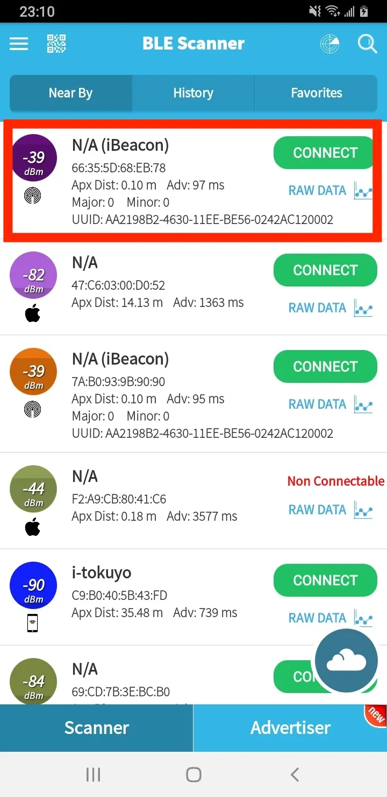
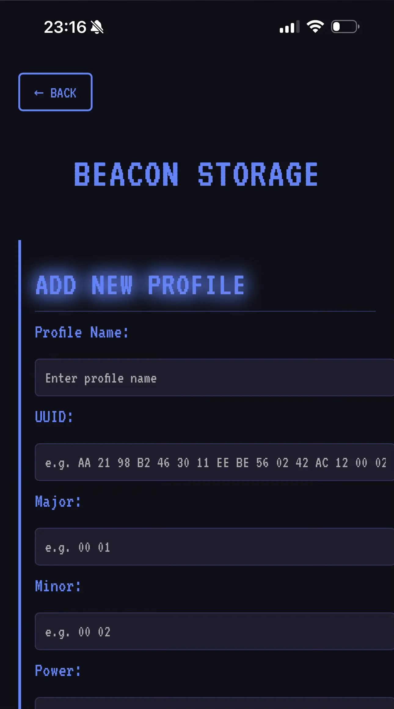
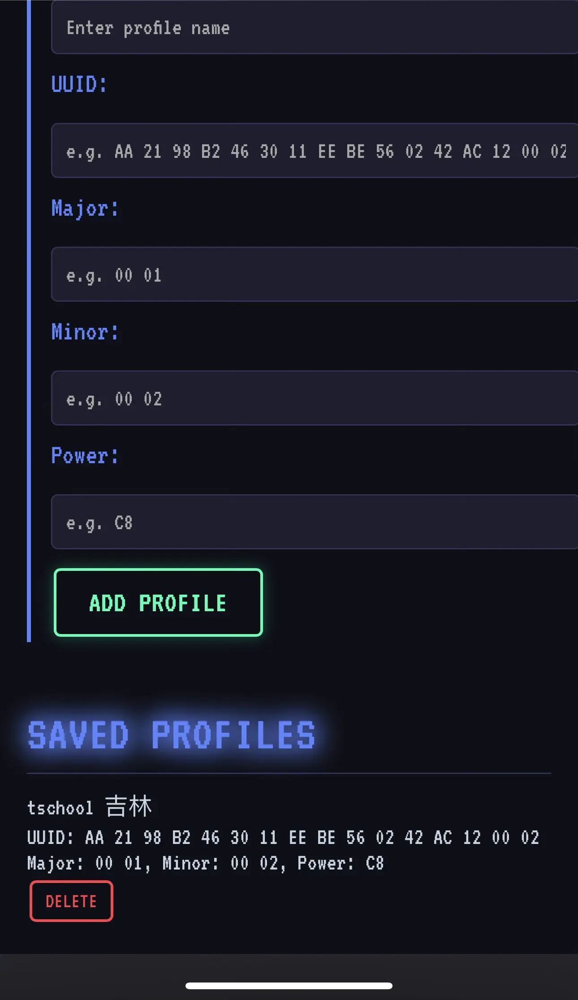
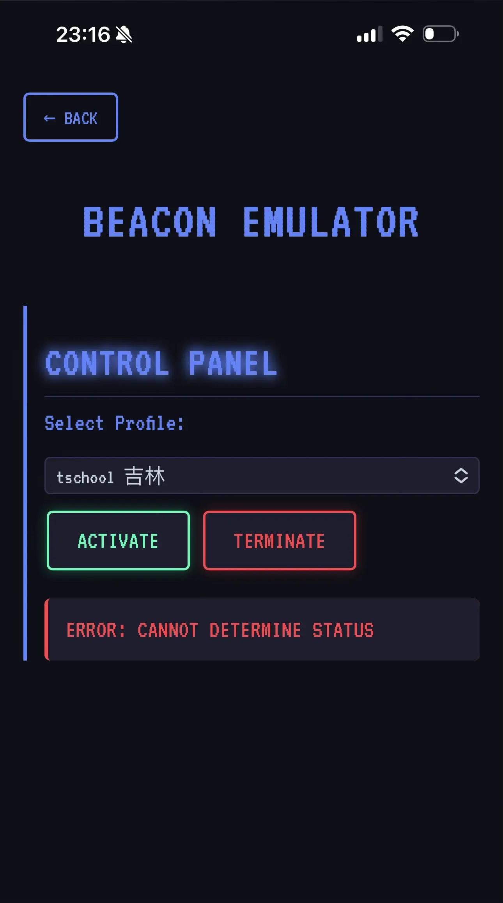

本頁面將介紹什麼是藍牙 Beacon，以及如何在 HackMaster Pi 上模擬藍牙 Beacon 設備。

## 什麼是藍牙 Beacon？

藍牙 Beacon 是一種使用低功耗藍牙（BLE）技術廣播訊號的小型無線設備。這些設備設計用於在短距離內傳輸簡單的資料。

### Beacon 的主要特點：

* **小巧便攜**：通常是可以放置在幾乎任何地方的小型硬體設備。
* **電池供電**：大多數 Beacon 使用電池供電，可以持續運作數月或數年。
* **單向通訊**：Beacon 只發送訊號，不接收回傳資訊。
* **定位服務**：主要用途是協助室內定位，在 GPS 訊號不良的環境中運作。

## 如何模擬藍牙 Beacon 設備？

這裡我們將透過打卡系統的範例，示範如何模擬藍牙 Beacon 設備。

### 使用情境說明

許多企業使用藍牙 Beacon 作為員工打卡系統，透過檢測員工手機是否接近特定 Beacon 來記錄出勤。透過 HackMaster Pi，您可以檢測這類系統的安全性，評估是否存在被偽造的風險。

:::caution[合法使用提醒]
本功能僅供測試自有系統的安全性。未經授權模擬他人的 Beacon 設備可能違反法律。
:::

### 操作步驟

1. 使用 Android 手機靠近要檢測的打卡藍牙設備。

2. 下載並開啟 `BLE Scanner` 應用程式：[https://play.google.com/store/apps/details?id=com.macdom.ble.blescanner&pcampaignid=web_share](https://play.google.com/store/apps/details?id=com.macdom.ble.blescanner&pcampaignid=web_share)

3. 找到 dBm 值最高的藍牙設備（通常代表距離最近的設備）。

    

4. 記錄下 `UUID`、`Major` 和 `Minor` 的數值。例如，在上圖中：
    * UUID: `AA2198B2-4630-11EE-BE56-0242AC120002`
    * Major: `0`
    * Minor: `0`

5. 將這些數值轉換為十六進位資料，每個位元組之間加上空格。例如，在上圖中：
    * UUID: `AA 21 98 B2 46 30 11 EE BE 56 02 42 AC 12 00 02`
    * Major: `00 00`
    * Minor: `00 00`

6. 在 `Beacon Storage` 頁面輸入這些資訊：`http://[IP]/BLE/beacon-storage`

    

7. 按下 `ADD PROFILE` 按鈕儲存藍牙 Beacon 資訊。

    

8. 前往 `Beacon Emulator` 頁面（`http://[IP]/BLE/beacon-emulator`），選擇藍牙 Beacon 資訊設定檔，然後您就可以啟動和終止模擬。

    

## 安全性評估建議

在完成 Beacon 模擬測試後，如果發現系統存在安全風險，建議採取以下改善措施：

### 企業端改善方案
- 結合多重認證機制（如密碼、生物辨識）
- 加入 GPS 定位驗證
- 實施時間區間限制
- 記錄並分析異常的打卡行為

### 個人防護建議
- 關注打卡系統是否有異常記錄
- 定期更新手機藍牙相關應用程式
- 在非必要時關閉藍牙功能

## 技術細節

HackMaster Pi 使用 BlueZ 協定堆疊與 hcitool 工具來實現 BLE Beacon 模擬功能：

```bash
# 啟動 Beacon 廣播（範例指令）
sudo hcitool -i hci0 cmd 0x08 0x0008 1E 02 01 1A 1A FF 4C 00 02 15 ...
```

這個功能利用了 Raspberry Pi Zero 2 W 內建的藍牙 4.2 功能，可以模擬各種 iBeacon 協定的設備。

<style>
  img {
    max-width: 300px !important;
    width: 100%;
    display: block;
    margin: 0 auto;
  }
</style>
