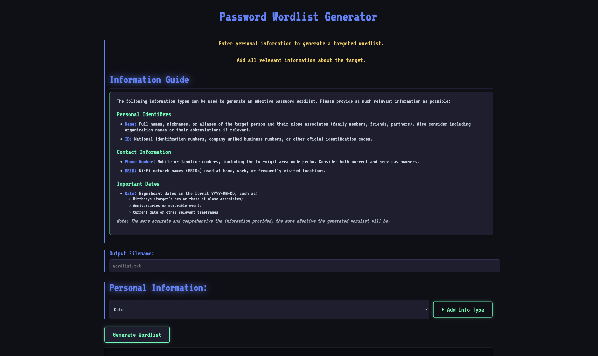

本頁面將教您如何在 HackMaster Pi 上建立自訂的密碼字典檔案，用於 Wi-Fi 密碼強度檢測。

## 功能簡介

密碼字典產生器是進行 Wi-Fi 密碼強度檢測的重要工具。透過收集目標相關的資訊，可以產生更有效的密碼字典，大幅提高檢測的成功率。

:::tip[為什麼需要自訂字典？]
研究顯示，大多數人設定密碼時會使用與自己相關的資訊，如生日、電話號碼、親人姓名等。相較於使用通用字典，針對目標客製化的字典能更有效地檢測密碼強度。
:::

## 可用的資訊類型

以下資訊類型可以用來產生有效的密碼字典：

### **姓名（Name）**
- 目標人物及其親近人士的全名、暱稱或別名（家人、朋友、伴侶）
- 如果與組織相關，也考慮包含組織名稱或其縮寫
- **範例**：`張三`、`小明`、`TechCorp`

### **身分證字號（ID）**
- 國民身分證字號
- 公司統一編號
- 其他官方識別代碼
- **範例**：`A123456789`、`12345678`

### **電話號碼（Phone Number）**
- 手機或市內電話號碼，包含兩位數的區域碼前綴
- 考慮目前和過去使用的號碼
- **範例**：`0912345678`、`0223456789`

### **SSID**
- 家中、工作場所或經常造訪地點使用的 Wi-Fi 網路名稱
- **範例**：`MyHomeWiFi`、`Office_5F`

### **日期（Date）**
- 以 YYYY-MM-DD 格式的重要日期，例如：
  - 生日（目標本人或親近人士）
  - 紀念日或重要事件
  - 當前日期或其他相關時間框架
- **範例**：`1990-01-01`、`2020-12-25`

## 使用方法

### 步驟一：設定字典檔案名稱
在「Wordlist File Name」欄位輸入您想要建立的字典檔案名稱。

### 步驟二：選擇並填入相關資訊
根據您掌握的資訊，選擇對應的類別並填入詳細內容：
- 點擊「Add」按鈕新增資訊欄位
- 可以新增多筆同類型的資訊（如多個生日、多個電話號碼）
- 填寫完整且正確的資訊能提高字典的有效性

### 步驟三：產生字典
點擊「Generate Wordlist」按鈕，系統將自動：
1. 組合您輸入的所有資訊
2. 產生常見的密碼變化形式
3. 建立字典檔案供後續使用



## 密碼組合策略

密碼字典產生器會自動產生以下常見的密碼組合模式：

### 基本組合
- 原始資料：`name`、`phone`、`date`
- 數字組合：`name123`、`phone2024`
- 日期組合：`name0101`、`date1990`

### 常見變化
- 大小寫變化：`Name`、`NAME`、`nAmE`
- 特殊符號：`name!`、`name@123`、`name_2024`
- 倒序組合：`eman`、`3210name`

### 進階組合
- 多項混合：`name+phone`、`ssid+date`
- 常用詞彙：`name+love`、`name+wifi`
- 鍵盤模式：`qwerty123`、`asdf1234`

## 實際應用情境

### 情境一：居家網路安全檢測
小明想要檢測家中 Wi-Fi 密碼的強度，他收集了以下資訊：
- **姓名**：自己和配偶的姓名
- **生日**：自己、配偶、小孩的生日
- **電話**：家用電話、手機號碼
- **SSID**：`MyHomeWiFi`

產生字典後進行檢測，發現密碼在 5 分鐘內就被破解，證明密碼強度不足。

:::tip[改善建議]
檢測後發現密碼太弱，建議：
- 使用隨機密碼產生器
- 密碼長度至少 12 位以上
- 混合大小寫、數字和特殊符號
- 避免使用個人相關資訊
:::

### 情境二：企業辦公室檢測
資訊部門想要檢測員工設定的訪客 Wi-Fi 密碼：
- **組織名稱**：公司名稱和縮寫
- **地址資訊**：辦公室地址、樓層
- **常用詞彙**：`guest`、`visitor`、`wifi`

檢測後發現多個弱密碼，制定新的密碼政策。

### 情境三：安全意識訓練
在資安教育訓練中，使用密碼字典產生器展示：
- 密碼被破解的難易度
- 個人資訊與密碼安全的關係
- 強密碼的重要性

## 效能與限制

### 字典大小
- 輸入資訊越多，產生的字典越大
- 建議單一字典不超過 10 項資訊
- 過大的字典會增加檢測時間

### 檢測時間
根據 Raspberry Pi Zero 2 W 的效能限制：
- 小型字典（< 1萬條）：數分鐘
- 中型字典（1-10萬條）：數十分鐘
- 大型字典（> 10萬條）：數小時

:::note[效能建議]
本系統定位為「安全檢測工具」而非「暴力破解工具」。主要目的是驗證密碼強度與找出安全弱點，而非實際破解複雜密碼。
:::

## 技術細節

密碼字典產生器使用 Python 與 crunch 工具實現：

```python
# 範例：產生基於個人資訊的密碼組合
def generate_wordlist(name, date, phone):
    patterns = [
        name,
        name + date[:4],  # name + year
        phone[-8:],        # last 8 digits
        name + phone[-4:], # name + last 4 digits
        # ... 更多組合模式
    ]
    return patterns
```

## 法律與倫理提醒

:::caution[重要聲明]
密碼字典產生器僅供合法用途：

**合法使用情境**：
- 檢測自有設備的密碼強度
- 取得書面授權的滲透測試
- 資訊安全教育與研究

**禁止使用情境**：
- 未經授權破解他人網路
- 竊取他人網路資源
- 任何以營利為目的的非法行為

根據我國《刑法》第 358 條（入侵電腦罪），未經授權存取他人網路可處五年以下有期徒刑。請務必在合法授權的前提下使用本工具。
:::

## 最佳實踐建議

### 對於測試者
1. **取得授權**：確保有明確的書面授權
2. **記錄過程**：詳細記錄測試過程和結果
3. **限定範圍**：僅測試授權範圍內的目標
4. **保護資料**：妥善保管產生的字典檔案

### 對於一般使用者
1. **檢測自己**：定期檢測自己設定的密碼強度
2. **提升意識**：了解弱密碼的風險
3. **改善習慣**：養成使用強密碼的習慣
4. **教育他人**：分享密碼安全知識

## 相關資源

- [下一步：Wi-Fi 密碼破解](/zh-tw/usage-wifi/wifi-cracker)
- [密碼安全最佳實踐指南](https://www.nist.gov/password-guidelines)
- [我國個資法與資安法規](https://law.moj.gov.tw/)
