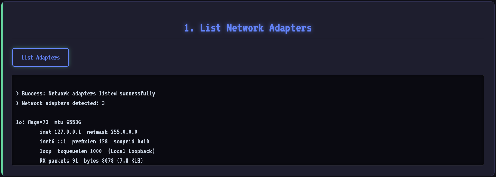
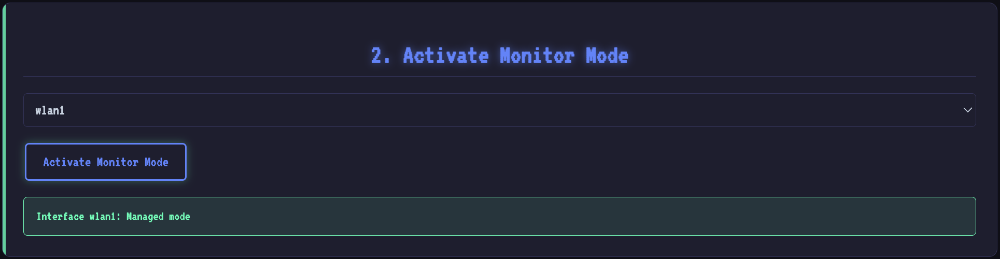
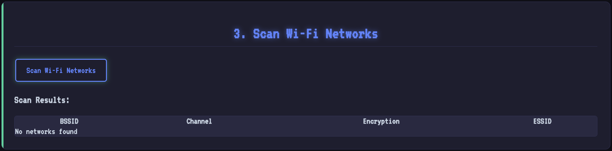
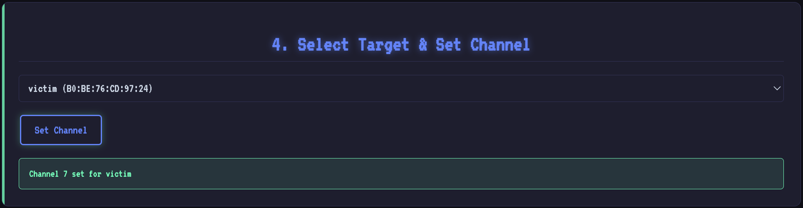
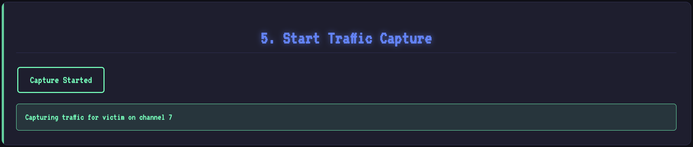
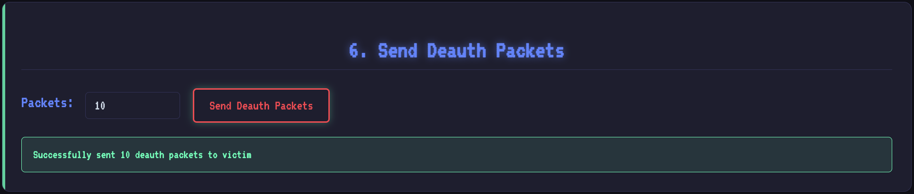
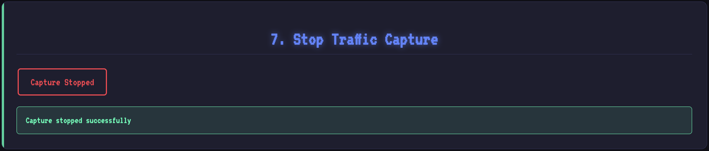
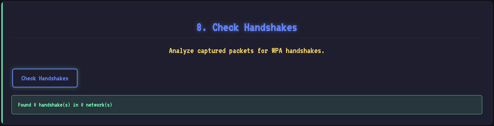
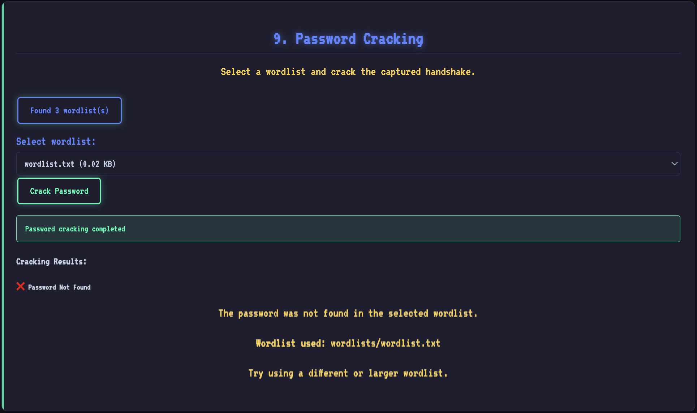

本頁面將教您如何使用 HackMaster Pi 進行 Wi-Fi 密碼強度檢測，透過四次握手封包擷取和字典攻擊來評估網路安全性。

:::caution[法律聲明]
**僅限合法使用**

本功能僅供檢測自有網路的密碼強度。未經授權入侵他人網路違反我國《刑法》第 358 條（入侵電腦罪），最高可處五年以下有期徒刑。

**合法使用情境**：
- 檢測自有家用或企業 Wi-Fi 的密碼強度
- 取得書面授權的網路安全檢測
- 資訊安全教育與研究

**使用前請確保**：
- 僅檢測自己擁有的網路
- 已取得網路所有者的明確授權
- 保留相關授權證明文件
:::

## 功能簡介

Wi-Fi 密碼破解功能整合了完整的無線網路安全檢測工具鏈，包括：
- 網路介面卡管理
- 監聽模式啟動
- Wi-Fi 網路掃描
- 四次握手封包擷取
- 解除認證攻擊（Deauth Attack）
- 密碼字典攻擊

## 技術原理

### WPA/WPA2 四次握手機制
當設備連接到 WPA/WPA2 保護的 Wi-Fi 網路時，會進行「四次握手」（4-way handshake）認證過程。透過擷取這個握手封包，結合密碼字典進行比對，可以驗證密碼的強度。

### 解除認證攻擊
透過發送解除認證封包，可以強制已連接的設備斷線重連，從而擷取四次握手封包。這是標準的滲透測試技術，用於驗證網路的安全性。

## 操作步驟

### 步驟 1：列出網路介面卡

首先，列出系統中可用的網路介面卡。



通常 Raspberry Pi Zero 2 W 的內建 Wi-Fi 介面為 `wlan0`。

### 步驟 2：選擇網路介面卡並啟動監聽模式

選擇要使用的網路介面卡，並啟動監聽模式（Monitor Mode）。



:::note[什麼是監聽模式？]
監聽模式（Monitor Mode）允許網路介面卡接收所有無線封包，而不僅限於發送給自己的封包。這是進行網路安全檢測的必要步驟。
:::

### 步驟 3：掃描 Wi-Fi 網路

按下「Scan Wi-Fi Networks」按鈕，等待約 20 秒，系統將掃描附近的 Wi-Fi 存取點（AP）。



掃描結果會顯示：
- **BSSID**：AP 的 MAC 位址
- **Channel**：使用的頻道
- **ESSID**：網路名稱（SSID）
- **Power**：訊號強度
- **Encryption**：加密類型（WPA/WPA2/WPA3）

### 步驟 4：選擇目標 AP 並設定頻道

從掃描結果中選擇要檢測的目標 AP，並設定對應的頻道。



:::tip[選擇建議]
- 選擇訊號強度較強的 AP（Power 值較高）
- 確認加密類型為 WPA/WPA2（WPA3 需要不同的攻擊方法）
- 記下 BSSID 和頻道資訊
:::

### 步驟 5：開始擷取流量

開始擷取目標 AP 的網路流量，系統將持續監聽該頻道上的封包。



### 步驟 6：發送解除認證封包

發送解除認證封包（Deauth Packets）給目標 AP，強制已連接的設備斷線重連，從而擷取四次握手封包。



:::warning[注意事項]
- 解除認證攻擊會暫時中斷目標網路的連線
- 僅對自有網路或已授權的網路執行此操作
- 頻繁的解除認證攻擊可能被視為惡意行為
:::

### 步驟 7：停止擷取流量

當擷取到足夠的封包（特別是四次握手封包）後，停止擷取流量。



### 步驟 8：檢查握手封包

檢查是否成功擷取到四次握手封包。



如果顯示「Handshake captured」，表示成功擷取到握手封包，可以進行下一步的密碼檢測。

:::tip[如果沒有擷取到握手封包]
- 確認目標 AP 有設備正在連線
- 重複步驟 5-7，並增加解除認證封包的數量
- 確認訊號強度足夠（靠近目標 AP）
- 檢查網路介面卡是否正常運作
:::

### 步驟 9：載入密碼字典並開始破解

選擇或上傳密碼字典檔案，開始進行密碼檢測。



系統將使用 aircrack-ng 工具，逐一比對字典中的密碼。檢測時間取決於：
- 字典的大小
- Raspberry Pi 的運算效能
- 密碼的複雜度

## 效能分析

### Raspberry Pi Zero 2 W 的檢測速度
- **小型字典**（< 1萬條）：數分鐘
- **中型字典**（1-10萬條）：數十分鐘至數小時
- **大型字典**（> 10萬條）：數小時至數天

:::note[效能限制說明]
Raspberry Pi Zero 2 W 的處理器效能有限，在執行 WPA2 密碼破解等密集運算任務時速度較慢。本系統定位為「安全檢測工具」而非「暴力破解工具」，主要目的是驗證密碼強度與找出安全弱點。
:::

## 實際應用情境

### 情境一：家用網路安全檢測

**背景**：小明擔心家中 Wi-Fi 密碼太簡單，想要測試是否容易被破解。

**操作流程**：
1. 使用自己的姓名、生日、電話等資訊產生密碼字典
2. 對自家 Wi-Fi 進行檢測
3. 發現密碼在 10 分鐘內就被破解

**改善措施**：
- 更換為隨機產生的強密碼（至少 12 位）
- 混合大小寫、數字和特殊符號
- 啟用 WPA3 加密（如設備支援）
- 定期更換密碼

### 情境二：企業網路稽核

**背景**：公司資訊部門需要評估各部門設定的 Wi-Fi 密碼是否符合安全標準。

**操作流程**：
1. 取得各部門主管的書面授權
2. 使用通用弱密碼字典進行檢測
3. 記錄檢測結果並提出改善報告

**成果**：
- 發現 30% 的 AP 使用弱密碼
- 制定新的密碼政策並強制執行
- 定期進行安全檢測

### 情境三：資安教育訓練

**背景**：在員工資安訓練中展示密碼安全的重要性。

**操作流程**：
1. 準備測試用的 Wi-Fi AP
2. 設定不同強度的密碼
3. 現場展示破解過程
4. 說明強密碼的設定原則

**效果**：
- 員工親眼見證弱密碼的風險
- 提升整體資安意識
- 促進安全行為的養成

## 技術細節

HackMaster Pi 整合了 Aircrack-ng 工具套件：

```bash
# 啟動監聽模式
sudo airmon-ng start wlan0

# 掃描 Wi-Fi 網路
sudo airodump-ng wlan0mon

# 擷取特定 AP 的流量
sudo airodump-ng -c [channel] --bssid [BSSID] -w capture wlan0mon

# 發送解除認證封包
sudo aireplay-ng -0 10 -a [BSSID] wlan0mon

# 使用字典破解密碼
sudo aircrack-ng -w wordlist.txt capture.cap
```

## 防護建議

### 對個人使用者

**強密碼原則**：
- 長度至少 12 位以上
- 混合大小寫字母、數字、特殊符號
- 不使用個人資訊（生日、姓名、電話）
- 不使用常見詞彙或模式

**進階防護**：
- 啟用 WPA3 加密（如設備支援）
- 定期更換密碼（建議 3-6 個月）
- 關閉 WPS 功能（易受攻擊）
- 隱藏 SSID（增加攻擊難度）

### 對企業組織

**政策制定**：
- 建立明確的 Wi-Fi 密碼政策
- 強制使用強密碼
- 定期進行安全稽核
- 區隔內部和訪客網路

**技術措施**：
- 使用企業級 AP 設備
- 實施 802.1X 認證
- 部署 WIPS（無線入侵防禦系統）
- 監控異常的網路活動

**教育訓練**：
- 定期舉辦資安訓練
- 透過實際演練提升意識
- 建立通報機制
- 獎勵良好的安全行為

## 故障排除

### 無法啟動監聽模式
```bash
# 檢查網路介面
iwconfig

# 停止可能衝突的程序
sudo airmon-ng check kill

# 手動啟動監聽模式
sudo ip link set wlan0 down
sudo iw dev wlan0 set type monitor
sudo ip link set wlan0 up
```

### 無法擷取握手封包
- 確認目標 AP 有設備正在連線
- 增加解除認證封包的數量
- 靠近目標 AP 以獲得更強的訊號
- 更換不同的網路介面卡

### 密碼檢測速度過慢
- 使用更小、更精準的密碼字典
- 考慮使用更強大的硬體（如 Raspberry Pi 4）
- 優先測試最常見的密碼組合
- 接受本工具的效能限制

## 延伸學習

### 相關工具與技術
- **Aircrack-ng**：無線網路安全檢測套件
- **Hashcat**：高速密碼破解工具
- **WPA3**：下一代 Wi-Fi 安全標準
- **KRACK Attack**：WPA2 的已知漏洞

### 推薦資源
- [Aircrack-ng 官方文檔](https://www.aircrack-ng.org/)
- [Wi-Fi Alliance 安全指南](https://www.wi-fi.org/discover-wi-fi/security)
- [NIST 無線網路安全指南](https://www.nist.gov/wireless-security)
- [我國資通安全管理法](https://law.moj.gov.tw/)

## 總結

Wi-Fi 密碼破解功能是 HackMaster Pi 的核心功能之一，透過「攻擊者思維」的角度：

✅ **幫助您**：
- 主動檢測密碼強度
- 及早發現安全弱點
- 避免被動等待攻擊
- 延長設備安全壽命

✅ **保護環境**：
- 減少設備被入侵的風險
- 避免成為殭屍網路的一部分
- 降低能源浪費和電子垃圾

✅ **履行責任**：
- 保護個人和企業資產
- 貢獻社會整體安全
- 實踐企業永續營運

記住：**預防勝於治療**，主動式安全檢測不只是技術工具，更是實踐環境永續和社會責任的具體方案！

---

### 下一步

- 返回：[密碼字典產生器](/zh-tw/usage-wifi/password-wordlist-generator)
- 探索：[Beacon 模擬器](/zh-tw/usage-ble/beacon)
- 了解：[AirPods 模擬器](/zh-tw/usage-ble/airpods)
